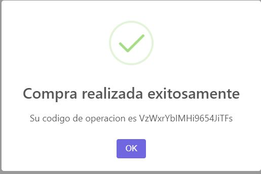

# Food Market
### Created by Juan Ignacio Vuoso - CoderHouse 2021

## Home
Al comenzar, en la pantalla principal se observan todos los productos disponibles para compra ("home" del web site, ruta '/').

<!-- -->

## Product details
Luego, cuando se quiera saber más informacion sobre cualquiera de los productos disponibles, debe hacerse click en 'Más información'. Aquí verá información detallada sobre el producto y podrá agregarlo al carrito en caso de que desee comprarlo posteriormente.

<!--

    

 
-->

Una vez agregado al carrito el producto (la cantidad deseada del mismo), puede seguirse comprando o bien ir al carrito para ver los productos que han sigo agregados hasta el momento.

Aqui pueden quitarse los productos por separado a conveniencia, y en todo momento se vera reflejado el precio total en funcipn de los productos que haya en ese momento en el carrito de compras.

<!--

    

-->

## Categories

En todo momento del flujo de compra puede filtrarse los productos por su categoría, clickeando en el drop-down del margen superior izquierdo. Este filtro mostrará todos los productos de la categoría que haya seleccionado.
La cantidad de categorias es dinamica y se obtienen de firebase. 

<!--

    

-->

Desde allí, puede nuevamente seleccionarse el producto requerido para ser posteriormente agregado al carrito.

## Shopping cart

En todo momento del flujo de compra (siempre y cuando la cantidad de productos seleccionados sea al menos uno), podrá observarse cuántos productos hay en el carrito, y acceder al mismo por medio de un click.
Una vez en el carrito pueden eliminarse los productos que se deseen, finalizar la compra, o bien seguir comprando. Recordemos que en todo momento puede clickearse 'Food Market' para ser redirigidos a la pagina principal.
<!--

    

-->

## End purchase / Check out

El formulario de finalización servirá para obtener los datos del usuario y generar la orden de compra, la cual será cargada en la base de datos de firebase.
Una vez completados los datos, se creará la orden de compra y el usuario obtendrá el codigo de dicha compra, para poder acceder a la misma, si así lo desea, a través de la web de firebase.
Ademas, se actualiza el campo de Stock en la base de datos en firestore, manteniendo a la misma actualizada en funcion de la cantidad de items de cada producto que se hayan comprado.
<!--

 
 

-->

